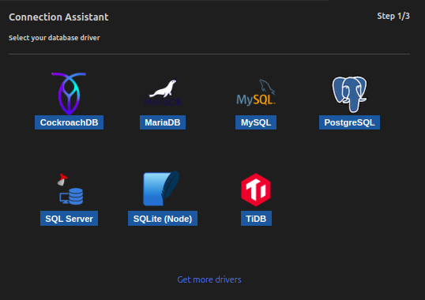
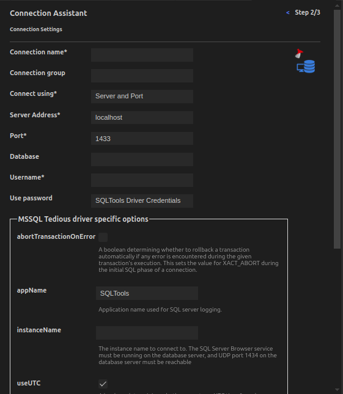
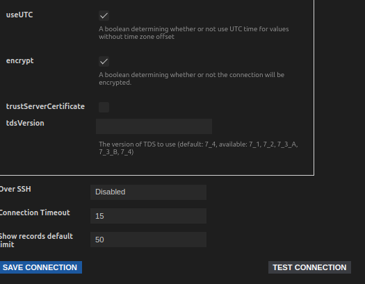
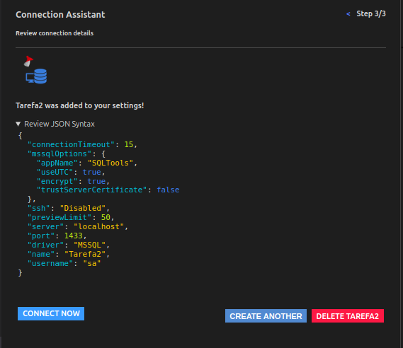
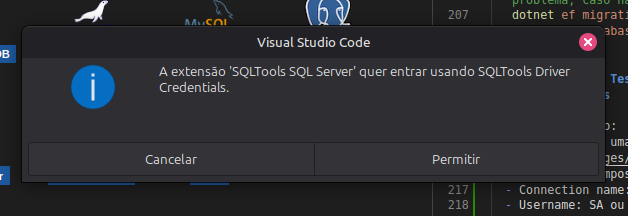
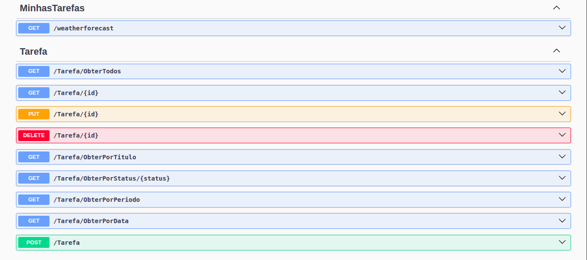

# Api de tarefa

## Sumário

- Estrutura do projeto (árvore)
- Visão rápida
- Primeiro Passos
- Estrutura do projeto (árvore)
- Arquivos auxiliares fora do projeto ApiTarefaMVC

## Estrutura do projeto (árvore)

Abaixo está uma árvore representativa da pasta ApiTarefa. Ajuste conforme arquivos reais do seu workspace.

```md
ApiTarefas/
├─ MinhasTarefas/
│  ├─ MinhasTarefas.csproj
│  ├─ Program.cs
│  ├─ appsettings.json
│  ├─ appsettings.Development.json
|  ├─ bin/
|  |  └─ Debug/
|  |     └─ net8.0/
|  ├─ Context/
|  |  └─ OrganizadorContext.cs
│  ├─ Controllers/
│  │  └─ TarefaController.cs
│  ├─ Models/
│  │  └─ Tarefa.cs
│  ├─ Migrations/
│  │  └─ [arquivos de migration...]
│  ├─ Properties/
│  │  └─ launchSettings.json
|
├─ DescricaoDoProjeto.md
├─ README.md
├─ .gitignore
├─ .vscode/
│  └─ settings.json
└─ docker-compose.yml (opcional)
```

---

## Visão rápida

Projeto exemplo de uma Web Api para gerenciar tarefas (CRUD) usado na trilha .NET. Contém endpoints para criar, ler, atualizar e deletar tarefas e exemplos para rodar com Docker / SQL Server.

## Primeiros Passos

1. Criando um projeto webapi no dotnet:
   - dotnet new webapi -n MinhasTarefas
2. Rodar o projeto MinhasTarefas:
   - dotnet run
3. Rodando o container sqlServer:
   - Dando stop caso ele esteja rodando:
     - docker stop Id ou nome do container
   - Excluindo containe antigo:
     - docker rm Id ou nome do container
   - Baixando a imagem do sqlServer caso não tenha:
     - docker pull mcr.microsoft.com/mssql/server:2025-latest
   - Criação do container e um usuario:
     - docker run -d --name mssql_tarefas -p 1433:1433 -e 'ACCEPT_EULA=Y' -e 'SA_PASSWORD=SuaSenhaForte123!' mcr.microsoft.com/mssql/server:2025-latest
   - docker start mssql
4. Instalação das ferramentas necessárias para usar com o Entity Framework:
   - dotnet add package Microsoft.EntityFrameworkCore.SqlServer
     - Microsoft.EntityFrameworkCore.SqlServer: Permite que o EF Core se comunique com o SQL Server (seu container Docker).
   - dotnet add package Microsoft.EntityFrameworkCore.Design
     - Microsoft.EntityFrameworkCore.Design: É necessário para rodar comandos como dotnet ef migrations no terminal.

---

## Segundo Passos

- Criação da classe Tarefa.cs dentro da pasta modelo

```cs
namespace MinhasTarefas.Models
{
    public class Tarefa
    {
        public int Id { get; set; }
        public string Titulo { get; set; }
        public string Descicao { get; set; }
        public DateTime Date { get; set; }
        public StatusTarefa Status { get; set; }
    }
}

```

- Classe Enum para enumerar o status da tarefa

```cs
   namespace ApiTarefaMVC.Models 
   { 
      public enum StatusTarefa 
      { 
         Pendente, 
         EmAndamento, 
         Concluida 
      } 
   }
```

## Terceiro Passo

- O DbContext é a ponte entre sua aplicação .NET e o banco de dados, usando o Entity Framework Core (EF Core).

```cs
   using Microsoft.EntityFrameworkCore;
   using MinhasTarefas.Models;

   namespace MinhasTarefas.Context
   {
      public class TarefasContext : DbContext
      {
         // Contrutor que recebe as opções do DbContext
         public TarefasContext(DbContextOptions<TarefasContext> options) : base(options) { }

         public DbSet<Tarefa> Tarefas { get; set; } = null!;      
      }
   }

```

- Configurando a Conexão: Definir o ConectionString no arquivo appsettings.Development.json caso o projeto não seja para produção e sim só desenvolvimento ou caso contrário mude o appsettings.json
- Configurar a Injeção de Dependência no Program.cs
   1. Precisamos dizer ao ASP.NET Core que use essa string de Conexão para configurar o DbContext
   2. No arquivo Program.cs

```cs
   using Microsoft.EntityFrameworkCore;
   using MinhasTarefas.Context;
   using MinhasTarefas.Models;

   var builder = WebApplication.CreateBuilder(args);

   builder.Services.AddDbContext<OrganizadorContext>(options =>
      options.UseSqlServer(builder.Configuration.GetConnectionString("ConexaoPadrao"))
   );

   builder.Services.AddControllers();
   builder.Services.AddEndpointsApiExplorer();
   builder.Services.AddSwaggerGen();

   var app = builder.Build();

   if (app.Environment.IsDevelopment())
   {
      app.UseSwagger();
      app.UseSwaggerUI();
   }

   app.UseHttpsRedirection();
   // A linha abaixo é muito importante para mapear os seus controller, então não esqueça de inserir ela.
   app.MapControllers();

   var summaries = new[]
   {
      "Freezing", "Bracing", "Chilly", "Cool", "Mild", "Warm", "Balmy", "Hot", "Sweltering", "Scorching"
   };

   app.MapGet("/weatherforecast", () =>
   {
      var forecast =  Enumerable.Range(1, 5).Select(index =>
         new WeatherForecast
         (
               DateOnly.FromDateTime(DateTime.Now.AddDays(index)),
               Random.Shared.Next(-20, 55),
               summaries[Random.Shared.Next(summaries.Length)]
         ))
         .ToArray();
      return forecast;
   })
   .WithName("GetWeatherForecast")
   .WithOpenApi();

   app.Run();

   record WeatherForecast(DateOnly Date, int TemperatureC, string? Summary)
   {
      public int TemperatureF => 32 + (int)(TemperatureC / 0.5556);
   }
```

## Quarto Passo - Configurando o arquivo appsettings.Development.json

```json
   {
      "Logging": {
         "LogLevel": {
            "Default": "Information",
            "Microsoft.AspNetCore": "Warning"
         }
      },
      "ConnectionStrings": {
         "ConexaoPadrao": "Server=localhost,1433; Initial Catalog=Tarefa; User Id=sa; Password=SuaSenhaForte123!; TrustServerCertificate=True; MultipleActiveResultSets=True"
      }
   }
```

## Quinto Passo - Criando as migrations

### comando dotnet ef

```bash
   dotnet build # vode primeiro e veja se tem algum problema, caso não tenha, agora rode o sequinte comando:
   dotnet ef migrations add InitialCreate
   dotnet ef database update
```

## Sexto Passo - Testando a criação do banco de dados com a extensão Sqltools

- Abra a extensão:
- Click em criar uma nova conecao

- Complete os campos de conexão:
  - Connection name: Qualquer nome
  - Username: SA ou sa
  - click na caixa do trustServerCertificate





- E click em Save Connection
- E click em Connecti Now



- Permita se essa mensagem aparecer para você



- E na proxima caixinha que aparecer coloque sua senha

## Setimo Passo - Use o Swagger para consultar as rotas



## Estrutura do Código

A seguir uma descrição das pastas principais deste projeto e do papel do código dentro de cada uma delas. Ela explica conceitualmente o que cada pasta serve e o que o código nela contido faz para o funcionamento da aplicação.

### 📁 [Context](./Context/)

- O que é: contém a implementação do DbContext (ex: ApplicationDbContext) usado pelo Entity Framework Core.
- Função conceitual: representa a sessão com o banco de dados; mapeia entidades (Models) para tabelas e fornece DbSet\<T> para operações CRUD.
- Código típico e o que faz:
  - propriedade DbSet\<Tarefa> Contatos — expõe a coleção de contatos para consultas e alterações.
  - construtor que recebe DbContextOptions e chama base(options) — permite a configuração via DI (AddDbContext).
  - método OnModelCreating(ModelBuilder modelBuilder) — configura regras de mapeamento (nomes de tabela, tipos, índices, relações, constraints).
  - registro no Program.cs/Startup: builder.Services.AddDbContext\<ApplicationDbContext>(options => options.UseSqlServer(...)) — integra o contexto ao pipeline da aplicação.
- Resultado para o programa: fornece a API de acesso ao banco, traduz LINQ em SQL e controla o rastreamento de entidades e persistência (SaveChanges / SaveChangesAsync).

### 🗂️ [Controllers](./Controllers/)

- O que é: contém controladores Web API (ex: ContatoController) que expõem endpoints HTTP (GET, POST, PUT, DELETE).
- Função conceitual: recebem requisições HTTP, validam dados, coordenam operações de domínio (aqui, via DbContext) e retornam respostas HTTP (200, 201, 404, 400...).
- Código típico e o que faz:
  - anotações [ApiController] e [Route("api/[controller]")] — ativam comportamento de API e definem rota base.
  - ações:
    - GET /api/Tarefas — busca todos os registros; normalmente retorna Ok(lista).
    - GET /api/Tarefas/{id} — busca por id; se não encontrado, retorna NotFound.
    - POST /api/contatos — cria novo registro; valida ModelState, adiciona ao DbContext e chama SaveChanges, retorna CreatedAtAction.
    - PUT /api/Tarefas/{id} — atualiza registro; verifica existência, aplica alterações e SaveChanges.
    - DELETE /api/Tarefas/{id} — remove registro e SaveChanges.
  - injeção do ApplicationDbContext via construtor — o controller usa o contexto para acessar o banco.
- Resultado para o programa: transforma chamadas HTTP em operações no banco e define contrato REST da API.

### 🧾 [Migrations](./Migrations/)

- O que é: pasta gerada pelo Entity Framework Core que contém classes de migração e o arquivo de snapshot do modelo.
- Função conceitual: versiona alterações do esquema do banco; cada migração tem métodos Up (aplica mudanças) e Down (reverte).
- Código típico e o que faz:
  - classe de migração (ex: 20250xxxxx_CriacaoTabelaContato) com Up criando tabela Contatos (colunas, tipos, constraints) e Down removendo-a.
  - ModelSnapshot — representa o estado atual do modelo para que o EF saiba quais mudanças criar nas próximas migrações.
- Resultado para o programa: possibilita criar/atualizar o banco de dados a partir do modelo de código (dotnet-ef migrations add / dotnet-ef database update) garantindo consistência entre modelo e esquema.

### 🧩 [Models](./Models/)

- O que é: contém as classes que representam as entidades do domínio (ex: Contato.cs).
- Função conceitual: definem a forma dos dados, validações e regras simples de negócio no nível da entidade.
- Código típico e o que faz:
  - propriedades (ex: int Id, string Nome, string Email, string Telefone).
  - Data Annotations ([Key], [Required], [MaxLength], [EmailAddress]) — definem validação e influenciam migrações (tamanho de colunas, nulabilidade).
  - possivelmente métodos auxiliares ou validações internas (ex: validar formato, máscaras).
- Resultado para o programa: modelos definem contrato de dados usados pelo DbContext, pelas migrações e pelos controllers; garantem validação automática do modelo recebido na API.

Resumo de integração

- Fluxo típico: Controller recebe a requisição -> valida o Model (ModelState) -> usa ApplicationDbContext (Context) para consultar/alterar Models -> EF gera SQL baseado nas Models/Migrations -> banco persiste os dados.
- Ferramentas importantes: dotnet-ef para gerar e aplicar Migrations; DI do .NET para injetar o DbContext; atributos de validação para proteger a entrada de dados.

Boas práticas rápidas

- Manter Models simples e focadas em dados; regras de negócio mais complexas podem ir para uma camada de serviço.
- Usar DTOs para entrada/saída quando precisar separar entidade de contrato HTTP.
- Versionar migrações e não editar migrações já aplicadas em produção; gere novas migrações para alterações.
- Tratar exceções de acesso a dados e retornar códigos HTTP adequados
