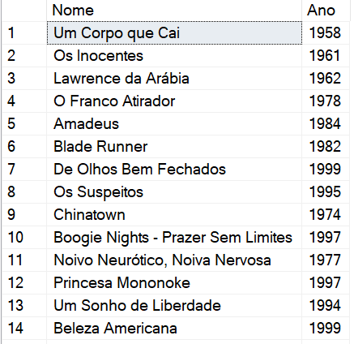
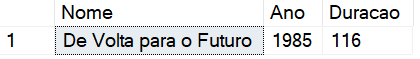

# Fundamentos de Banco de Dados

## Desafio de projeto

Para este desafio, você precisará usar seus conhecimentos adquiridos no módulo de banco de dados, da trilha .NET da DIO.

## Contexto

Você é responsável pelo banco de dados de um site de filmes, onde são armazenados dados sobre os filmes e seus atores. Sendo assim, foi solicitado para que você realize uma consulta no banco de dados com o objetivo de trazer alguns dados para análises.

## Proposta

Você precisará realizar 12 consultas ao banco de dados, cada uma retornando um tipo de informação. O seu banco de dados está modelado da seguinte maneira:

**As tabelas sao descritas conforme a seguir:**

### Filmes

Tabela responsável por armazenar informações dos filmes.

### Atores

Tabela responsável por armazenar informações dos atores.

### Generos

Tabela responsável por armazenar os gêneros dos filmes.

### ElencoFilme

Tabela responsável por representar um relacionamento do tipo muitos para muitos entre filmes e atores, ou seja, um ator pode trabalhar em muitos filmes, e filmes podem ter muitos atores.

### FilmesGenero

Tabela responsável por representar um relacionamento do tipo muitos para muitos entre filmes e gêneros, ou seja, um filme pode ter mais de um gênero, e um genêro pode fazer parte de muitos filmes.

## Preparando o banco de dados

Você deverá executar o arquivo Script Filmes.sql em seu banco de dados SQL Server, presente na pasta Scripts deste repositório (ou clique aqui). Esse script irá criar um banco chamado Filmes, contendo as tabelas e os dados necessários para você realizar este desafio.

## Objetivo

Você deverá criar diversas consultas, com o objetivo de retornar os dados a seguir. Abaixo de cada pedido tem o retorno esperado. O seu retorno deve ser igual ao da imagem.

## 1 - Buscar o nome e ano dos filmes

## 2 - Buscar o nome e ano dos filmes, ordenados por ordem crescente pelo ano

## 3 - Buscar pelo filme de volta para o futuro, trazendo o nome, ano e a duração

## 4 - Buscar os filmes lançados em 1997

## 5 - Buscar os filmes lançados APÓS o ano 2000

## 6 - Buscar os filmes com a duracao maior que 100 e menor que 150, ordenando pela duracao em ordem crescente

## 7 - Buscar a quantidade de filmes lançadas no ano, agrupando por ano, ordenando pela duracao em ordem decrescente

## 8 - Buscar os Atores do gênero masculino, retornando o PrimeiroNome, UltimoNome

## 9 - Buscar os Atores do gênero feminino, retornando o PrimeiroNome, UltimoNome, e ordenando pelo PrimeiroNome

## 10 - Buscar o nome do filme e o gênero

## 11 - Buscar o nome do filme e o gênero do tipo "Mistério"

## 12 - Buscar o nome do filme e os atores, trazendo o PrimeiroNome, UltimoNome e seu Papel

